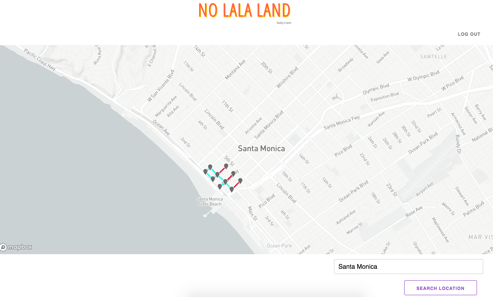
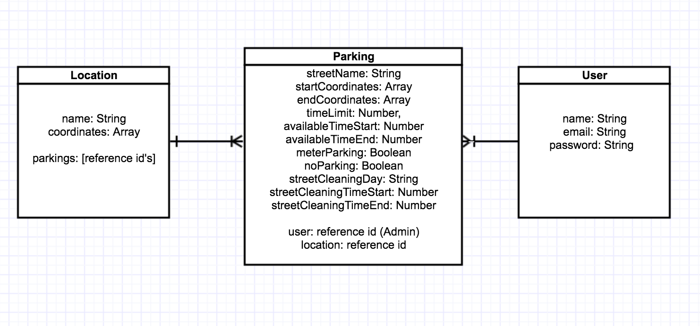
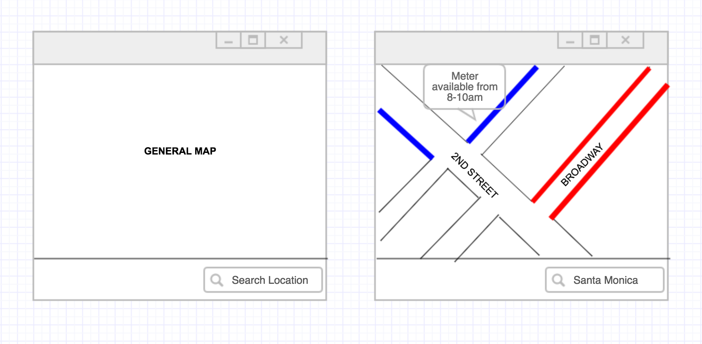

# PROJECT 04: NO LALA LAND
---

## Introduction
**NO LALA LAND** is an online map application with street parking information (street cleaning, parking hours, parking fees, etc) in vicinity of the location queried, in purpose of solving street parking problems and preventing parking ticket issues.



Come visit [NO LALA LAND](https://lala-park.herokuapp.com/) here!

## Installation
**Note:** At the moment, available parking Data is limited to Santa Monica and the parking information is hypothetical.

**For Users:** <br>
1. Go to [NO LALA LAND](https://lala-park.herokuapp.com/). <br>
2. Sign up and log in if you'd like. You can still search without logging in. <br>
3. Search for **Santa Monica** (other locations will be available in the future)
4. Click on the marks to see the parking info on the street! <br>

**For Developers:** <br>
1. Fork and clone my **"lala-client-server"** repository, which has both client-side and server-side of the application. <br>
2. Run ```nodemon``` command in in **express-server** folder.<br>
3. Run ```npm start```command in **react-client** folder. 

## Technologies
This application was built on Node.js, Express, React with ES6, Mongoose, Miligram and Bootstrap styling. Mapbox was used as the 3rd party API.


## Project Organization
**ERD Modeling**


**Wireframe**


[User Stories List](https://1drv.ms/x/s!Atf2EKHjvdCegQSuzjkKQMYP2JJR)

[Trello Board](https://trello.com/b/pg3n0e4l/project-04-la-la-park)

## Approaches Taken

**1. Conecpt**<br>
	Brainstorm couple of web application ideas I had throughout the course and research the web for existing application with similar concepts. <br>
**2. Language**<br>
Decide on back-end and front-end language and framework accordingly to application characteristic and personal interests.<br>
**3. Resource research** <br>
More thorough research on the concept and potential 3rd party API aviailable online. <br>
**4. Scope** <br>
Set the MVP for the application considering the scope of the project and time accountance.<br>
**5. Execution** <br>
Build!

## Unsolved Problems / Additional Features
- Search by location and time, with conditional parking data according to the data provided.
- Use React Native to make it a mobile application.
- Utilize user's profile and add login profits.
- Use Mongoose geospatial indexing to cover a specific radius vicinity.
- Use LA street cleaning json data to populate data on the application.
